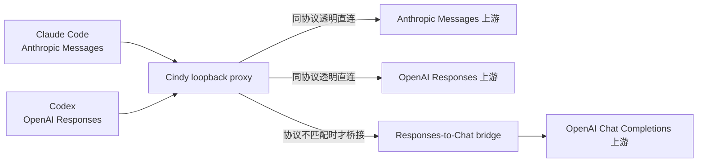

# OpenAI Chat Completions 厂商双通道实施方案

> 状态：待实施。
> 范围：当前只落地 Phase 1——把 Codex 的 OpenAI Responses 请求桥接到供应商的 OpenAI Chat Completions 接口；Phase 2 及其它协议按真实需求后续实施。
> 相关现状：`packages/anthropic-responses-bridge` 实现了 Claude Code 侧已有的 Anthropic Messages → OpenAI Responses bridge；本文补齐 Codex 访问 Chat-only 上游的方向。

## 1. 目标与最终结论

Cindy 当前内置 API-key 厂商均已具备 OpenAI Chat Completions 基础能力；最大的覆盖缺口是其中不少厂商没有完整 OpenAI Responses API，而 Codex 当前只说 Responses。因此本轮投入产出比最高的方案是：



实施边界：

1. **不引入第二套常驻代理。** 沿用 Cindy 现有 loopback proxy 和 `RoutingDecision.localHandler`，不整体嵌入 OpenCodex 或 CC Switch。
2. **不先建设大一统协议中台。** 新增边界明确、零 Electron 依赖的 Responses-to-Chat bridge；内部只为流式状态机使用最小规范化结构。
3. **数据驱动选协议。** provider/runtime 显式声明 wire protocol，禁止按 `provider.id` 堆条件分支。
4. **同协议永远优先透明直连。** 原生 Responses 不经过解析或重写；只有 Chat 上游进入 bridge。
5. **桥接不等于原生完整兼容。** 产品区分“原生支持”“Cindy 桥接支持”“不支持”，并显示已知降级能力。
6. **Phase 2 后置。** Responses → Anthropic Messages、Gemini Native、多模态、failover 等不阻塞本轮。

## 2. 现状基线

### 2.1 与现有协议桥的关系和隔离边界

Cindy 现有 `packages/anthropic-responses-bridge` 与本计划的新桥是共享代理基础设施的两条**兄弟路径**，不串联，也不是把现有翻译器倒过来使用：

| 维度 | 现有桥 | 本计划新桥 |
|---|---|---|
| 客户端 | Claude Code | Codex |
| 客户端协议 | Anthropic Messages | OpenAI Responses |
| 上游协议 | OpenAI Responses | OpenAI Chat Completions |
| 请求方向 | Anthropic → Responses | Responses → Chat |
| 响应方向 | Responses SSE → Anthropic SSE | Chat SSE → Responses SSE |
| 挂载点 | Claude loopback proxy | Codex loopback proxy |

两者只共享：

- `packages/anthropic-compat-proxy` 的 loopback server、`RoutingTransform` 和 `RoutingDecision.localHandler`；
- provider catalog、per-session 来源选择、safeStorage/OAuth token reader、model rewrite、header 策略、统一 logger 和错误分类。

两者明确不共享：

- 请求翻译器和 SSE 状态机；
- 现有 bridge 的 Responses 最小类型（它只描述该桥自己生成的子集，不是 Codex 输入全集）；
- `SUBSCRIPTION_DIRECT_MODEL_PREFIXES` / `isSubscriptionDirectModel()` 零计费 gate。是否桥接、是否订阅、是否零计费是三个独立维度；本轮 API-key Chat bridge 不得误记为订阅 0 成本。

实施时不修改现有 `anthropic-responses-bridge` 的 `handler.ts`、`translate-request.ts`、`translate-sse.ts` 核心路径；它们是回归保护对象。若仅为 SSE 分行等稳定工具发现少量重复，先在新包内实现，待两条路径都有实测后再单独评估抽取，避免为了复用扩大现有 Claude Code 桥的回归面。

### 2.2 已有能力

- 两个 runtime 都已经通过 Cindy 本地代理出站：
  - Claude Code endpoint 由 `packages/maker-core/src/agents/claude-code/env-builder.ts` 和 `apps/desktop/src/main/maker-host/anthropic-compat-proxy-host.ts` 注入；
  - Codex Responses base URL 由 `apps/desktop/src/main/maker-host/codex-gateway-config.ts` 指向 `apps/desktop/src/main/maker-host/codex-proxy-host.ts`。
- `packages/anthropic-compat-proxy` 已提供通用路由和 `localHandler` 插槽，能够在同一进程内完成协议转换，不增加额外 HTTP 跳数。
- `packages/anthropic-responses-bridge` 已验证 local handler 模式可用于流式协议转换，但其方向是 Claude Code 的 Anthropic Messages → Responses 上游。
- `packages/model-providers` 是 per-runtime 模型、路由和预设的 SSoT。
- 当前自定义 provider 的 `codex` runtime 默认被解释为原生 Responses，连接探测固定调用 `/responses`，因此 Chat-only 上游无法仅靠补预设安全接入。

### 2.3 厂商目标路由

| Provider | Claude Code | Codex 目标路径 |
|---|---|---|
| OpenAI | 现有路径 | 原生 Responses，保持透明直连 |
| OpenRouter | 现有 Anthropic-compatible runtime | 原生 Responses，保持透明直连 |
| MiniMax CN / Global | 现有 Anthropic-compatible runtime | 官方 Responses，补 Codex runtime 后透明直连 |
| DeepSeek | 现有 Anthropic-compatible runtime | Responses → Chat bridge |
| 智谱 GLM CN / Z.ai Global | 现有 Anthropic-compatible runtime | Responses → Chat bridge |
| Kimi CN / Global / Kimi Code | 现有 Anthropic-compatible runtime | Responses → Chat bridge |
| 阿里百炼 Coding Plan | 现有 Anthropic-compatible runtime | Responses → Chat bridge |

该表只决定候选路径，不等于上线准入。Chat 上游必须通过第 7 节的流式工具调用验证矩阵。

## 3. 本轮范围

### 3.1 包含

- Codex Responses 请求 → Chat Completions 请求的确定性转换；
- Chat Completions SSE → Codex Responses SSE 的逐事件转换；
- 流式文本、普通 function tools、串行/并行工具调用、usage、取消和错误映射；
- provider/runtime wire protocol 元数据、校验、持久化和路由；
- 内置预设补齐 Codex runtime，原生 Responses 与 bridge 路径共存；
- 自定义 provider 可显式选择 Codex 上游协议；
- “测试连接”按协议探测，Chat bridge 至少做真实 SSE + tool-call 轻量探针；
- 四语言文案和原生/桥接/不支持状态展示；
- macOS、Windows、本地桌面、设备互联手机版控制端的适配和测试；
- 事件正确性、性能、缓存影响和回滚观测。

### 3.2 不包含

- Codex Responses → Anthropic Messages；
- Gemini Native 或其它私有协议 Adapter；
- Responses WebSocket；
- OpenAI 内置 web search、file search、code interpreter、computer use 的跨协议模拟；
- 服务端持久 response state 和完整 `previous_response_id` 续接；第一版以 Codex 实际发送的完整 `input` 为准，无法安全重建上下文时显式报不支持；
- 图片、文档、音频等多模态完整桥接；
- encrypted/redacted reasoning 无损转换；
- 完整 prompt cache、structured outputs、vendor server tools 语义模拟；
- 自动跨供应商 failover、熔断和账号池；
- 让 SSH 远程工作区通过本机 loopback bridge 出站。

## 4. 核心设计

### 4.1 per-runtime wire protocol

在 `packages/model-providers/src/types.ts` 增加稳定联合类型：

```ts
export type ProviderWireProtocol =
  | 'anthropic-messages'
  | 'openai-responses'
  | 'openai-chat';
```

协议必须放在 per-runtime 维度：

- `RoutingDescriptor.wireProtocol`：host 运行期权威；
- `ProviderPresetRuntime.wireProtocol`：预设数据；
- `CustomProviderRuntimeConfig.wireProtocol`：用户持久化配置。

兼容存量数据的默认值：

- `claude-code` 缺省为 `anthropic-messages`；
- `codex` 缺省为 `openai-responses`。

`RoutingDescriptor.adapter` 不作为协议真值；它继续承载同协议内少量无法数据化的 vendor quirk。

校验要求：

- 本轮 `claude-code` 自定义 runtime 只允许 Anthropic-compatible endpoint；
- `codex` 允许 `openai-responses`、`openai-chat`；
- catalog、preset 清洗、自定义 store 都验证协议值；
- `providerViewToConfig`、wizard、DB JSON normalize 不能在创建、编辑、重启后丢字段；
- device-link 对执行字段做剥离，只保留展示所需的兼容类型。

配置语义遵守 [`configuration-and-overrides.md`](./dev-rules/configuration-and-overrides.md)：Codex 上游协议是创建自定义端点时必须理解的常规字段，系统默认 Responses；存量用户未设置 override 时行为完全不变，恢复默认即清除 override、重新跟随 Responses 默认。

### 4.2 native fast path 与 bridge path

扩展 Codex per-session 路由，让一个决策点同时取得 runtime、上游、鉴权/header、model rewrite 和 wire protocol。

`apps/desktop/src/main/maker-host/codex-proxy-host.ts:createModelRoutingTransform` 的目标分支：

```text
codex + openai-responses
  → 现有 RoutingDecision，透明上游转发

codex + openai-chat
  → RoutingDecision.localHandler
  → handler 闭包携带 upstream/auth/model rewrite/capability

其它组合
  → 明确不支持，不得误投默认上游
```

不变量：

1. 路由必须基于 proxy 提供的**原始** `parsedBody` 与未改写 model 判定；bridge 命中后不得先跑 xAI/Responses 专用 transform，再转成 Chat；
2. 路由 scope 与 model rewrite 使用同一判据，防止请求回落默认上游但 body 已被第三方规则改写；
3. Chat bridge 使用路由阶段的原始 `parsedBody`，在内部按固定顺序执行 Cindy instructions 注入、model rewrite 和协议翻译，避免现有 Responses transforms 重复改写；
4. 鉴权沿用 safeStorage/generic OAuth reader；bridge config 和日志不含凭证明文；
5. 第三方 Chat 上游前删除 ChatGPT 专属 header：`chatgpt-account-id`、`openai-beta`、`originator`、`session_id`，以及不属于目标上游的 credential header；
6. native Responses 不解析、不重排响应事件，确保未来字段自然透传；
7. bridge 装配失败或协议不支持时 fail-closed 为该 runtime 不可用，不能透传到错误端点或默认网关；
8. 本轮 wire protocol 缺省值必须让存量 Claude/Codex provider 逐字段保持原行为，只有显式 `openai-chat` 才进入新桥。

### 4.3 新 package：Responses-to-Chat bridge

新增零 Electron 依赖的独立 package，建议结构：

```text
packages/responses-chat-bridge/
  src/types.ts
  src/translate-request.ts
  src/chat-sse-translator.ts
  src/handler.ts
  src/errors.ts
  src/usage.ts
  src/__tests__/*
```

不要把反向转换塞进 `anthropic-responses-bridge`；两者的客户端入口协议、输出事件和产品语义不同。只抽取真正稳定且无方向性的 SSE line reader、安全 JSON helper；首版不要为了复用重构现有 bridge 热路径。

建议配置契约：

```ts
interface ChatBridgeProviderConfig {
  upstreamBase: string;
  buildHeaders(): Promise<Record<string, string>>;
  rewriteModel(model: string): string;
  capabilities: {
    developerRole: boolean;
    parallelToolCalls: boolean;
    reasoningField?: 'reasoning_effort' | 'reasoning_content' | 'none';
    maxTokensField: 'max_tokens' | 'max_completion_tokens' | 'omit';
    streamUsage: boolean;
  };
  onUpstreamError?(info): void | Promise<void>;
}
```

capability 保持小而确定的闭合集；vendor 差异不得重新变成 provider-id 条件分支。

### 4.4 请求转换

| Responses | Chat Completions |
|---|---|
| `instructions` | `developer` message；上游不支持时确定性降级为首个 `system` message |
| `input` message | `messages` |
| assistant `function_call` item | assistant `tool_calls[]` |
| `function_call_output` | `role: tool` + `tool_call_id` |
| function `tools` | Chat `tools` |
| `tool_choice` | Chat `tool_choice` |
| `parallel_tool_calls` | capability 支持时透传，否则省略并标记降级 |
| `max_output_tokens` | capability 指定字段或省略 |
| `reasoning.effort` | capability 指定 vendor 字段；不支持则省略 |
| `stream` | 强制 `true` |
| Responses-only store/include/state | 删除，或无法安全降级时拒绝 |

原则：

- 未识别 input item 不得静默丢弃：返回结构化 unsupported-feature，仅记录字段类型而不记录内容；
- instructions、developer/system 历史消息的相对顺序稳定，不改产品 prompt 前缀；
- tools 保序并保留 JSON Schema，只对已验证的厂商限制做确定性清洗；
- assistant 文本与 tool call 可同轮共存；
- tool result 严格保持 `call_id` 关系；
- bridge 不维护跨请求会话状态，全部语义来自本次 Responses body。

### 4.5 Chat SSE → Responses 状态机

`ChatSseTranslator` 按 `tool_calls[index]` 维护独立状态，输出 Codex 所需事件：

- response created/in-progress；
- message output item + content part；
- `response.output_text.delta`；
- function-call output item；
- `response.function_call_arguments.delta` / done；
- output item done；
- completed/failed/incomplete；
- usage。

必须处理：

1. 同一 chunk 多个 tool call；
2. 并行 tool arguments 交错；
3. `id`、`name`、arguments 延迟出现；
4. arguments 被任意 chunk 边界切分；
5. 空参数、非法或截断 JSON；
6. 文本和工具调用混合；
7. `finish_reason=tool_calls|stop|length|content_filter`；
8. `[DONE]` 前后独立 usage chunk；
9. 正常 EOF 但缺终态事件；
10. 用户取消和网络中断。

ID 在单请求内稳定、唯一、可测试；上游没有 tool-call ID 时，以 request/response 标识和 index 确定性生成并持续复用。

性能约束：

- chunk 级增量读取，不缓存完整响应；
- SSE line scanner 避免 O(n²) buffer 拷贝；
- per-token 路径不打印正文、不 stringify 大对象、不做同步 I/O；
- 客户端关闭连接时 abort upstream fetch；
- 正确处理 `res.write` backpressure，不能无限积压。

### 4.6 错误、usage 与恢复

- fetch/超时转换为 Responses 形态网络错误；
- 上游 4xx/5xx 保留 HTTP status，并尽量保留原始 message/code；
- 401/403、429、context overflow、bad request、unsupported feature 与现有 `providerErrors` 分类对齐；
- `onUpstreamError` 先收口连接态，再返回原错误；回调失败不覆盖原错误；
- 已开始 SSE 后出错，输出合法 failed/incomplete 终态；无法继续编码时销毁连接，不能伪造 completed；
- 不做无限重试。首版默认不重试，除非能证明请求尚未被上游接受、不会重复计费或重复工具调用；
- usage 缺失时不伪造精确数值；可展示“上游未返回”。

## 5. Catalog、预设和 UI

### 5.1 预设数据

更新 `packages/model-providers/catalog/providers.json`：

- OpenRouter：Codex runtime 标记 `openai-responses`，保持现有 endpoint；
- MiniMax CN/Global：新增官方 Responses runtime；
- DeepSeek、GLM CN/Global、Kimi CN/Global、Kimi Code、百炼 Coding Plan：新增 `openai-chat` Codex runtime。

具体 endpoint、模型和 quirks 必须在实施时基于最新官方文档及活体探测复核；本文厂商列表是范围，不是静态 endpoint 真值。

### 5.2 自定义供应商

Codex runtime 增加“上游协议”选择：

- OpenAI Responses（推荐、默认、原生）；
- OpenAI Chat Completions（Cindy 桥接）。

Claude Code tab 继续明确要求 Anthropic-compatible endpoint，本轮不开放 Chat 选项。

### 5.3 展示语义

由 runtime wire protocol 派生：

- native：上游协议与 runtime 一致；
- bridged：`codex + openai-chat`；
- unsupported：当前组合没有 Adapter。

UI 使用现有主题 token，不新增颜色；文案走 `zh-CN`、`en`、`ja`、`ko` 四语言。示例：

```text
Codex · Cindy 桥接
支持：流式文本、工具调用
部分高级 Responses 能力不可用
```

禁止为每个供应商硬编码说明。

## 6. 代码接线范围

1. `packages/model-providers`
   - wire protocol 类型与缺省；
   - catalog/preset/custom config 校验；
   - `buildUserProvider` 带入路由；
   - registry/device presentation 暴露非敏感 compatibility 信息。
2. `packages/responses-chat-bridge`
   - 请求转换、SSE 状态机、handler、错误与 usage。
3. `apps/desktop/src/main/maker-host`
   - bridge host adapter，注入 logger/fetch/auth/capability；
   - Codex routing 命中 `openai-chat` 后返回 local handler；
   - 保持 native Responses 与 OpenAI/XD/xAI 现有路径字节级不变；
   - provider diagnostics 按协议探测。
4. renderer
   - `AddProviderWizard`、`CustomProviderDialog`、`ProvidersSection` 保留并展示协议；
   - 四语言 i18n；
   - 不增加 loading 页或视觉跳变。
5. device-link/mobile
   - provider 列表携带只读 native/bridged 标记；
   - 手机继续选择被控端 providerId，实际转换在被控桌面完成，不复制 bridge 代码。

## 7. 测试与准入

### 7.1 bridge 单测

请求转换：纯文本、instructions、developer/system 降级、assistant text + tool、function output、多工具、tool choice、reasoning/max token capability、unsupported item、model rewrite、不修改输入对象。

SSE 完整 trace：

- 文本 delta；
- 单工具 arguments 多 chunk；
- 两个并行工具交错；
- id/name 延迟；
- 文本与工具交错；
- usage 独立 chunk；
- stop/length/content_filter；
- malformed JSON；
- chunk 切在 UTF-8/SSE 分隔符中；
- EOF 无 `[DONE]`；
- 网络中断和取消。

断言完整事件顺序，而不只断言最终文本。

handler：URL/header/body、凭证不进日志、上游错误 status/code、错误回调时序、abort、backpressure、并发状态隔离。

### 7.2 provider/host 测试

- protocol 校验和存量缺省兼容；
- custom provider DB round-trip；
- preset wizard 和编辑 round-trip；
- routing matrix：Responses passthrough、Chat local handler、unsupported fail-closed；
- scope gate/model rewrite/header delete；
- OpenAI/XD/xAI 现有 snapshot 无回归；
- Responses probe 与 Chat streaming tool probe；
- device-link 不泄漏 URL/header/key，只返回展示标记。

### 7.3 每个预设的活体准入

至少验证：

1. 流式文本；
2. 单工具；
3. arguments 跨 chunk；
4. 两个并行工具；
5. tool result 第二轮；
6. 文本 + tool；
7. reasoning 开/关（若声明）；
8. 401/403；
9. 429；
10. context overflow；
11. 流中断；
12. 用户取消；
13. usage；
14. 长对话连续工具。

未通过 SSE + Agent Tool Calling 最低门槛的厂商不开放 Codex runtime，即使纯文本可用。

### 7.4 性能门禁

协议热路径必须测：

- bridge 额外 TTFT；
- 每 1,000 SSE event 的转换耗时与峰值内存；
- 完整工具事件无丢失、无错序；
- instructions/prompt 顺序与内容前后对比；
- vendor 有 cache usage 时记录前后；无法等价时明确“不保证 prompt cache”。

本方案不计划修改 maker-core translator/system prompt。若实施中必须触碰，需单独评审并遵守仓库缓存率、性能、返回速度和准确性实测门禁；系统提示词变更仍须先与 Lizi 确认。

## 8. 验证命令

实现阶段按实际 package script 校准，至少运行：

```bash
node --version
pnpm --version
pnpm --filter @lizi/model-providers test
pnpm --filter @lizi/anthropic-compat-proxy test
pnpm --filter @lizi/responses-chat-bridge test
pnpm --filter desktop typecheck
pnpm --filter desktop test -- <provider/host 定向测试>
pnpm test:unit
```

提 PR 前必须在仓库根完整运行并通过 `pnpm test:unit`。活体测试凭证只从 safeStorage/环境读取，禁止写入仓库、fixture、dump 或日志。

## 9. 灰度、观测和回滚

### 9.1 灰度

- bridge 仅由 `wireProtocol: 'openai-chat'` 激活，不提供全局“强制转换”开关；
- 先开放 1–2 个活体验证最充分的预设，再逐个开放；
- 远端 catalog 可通过移除 preset 的 Codex runtime 停止新建；已保存自定义 provider 仍由客户端 capability gate 保护。

### 9.2 日志与指标

允许记录：provider id、wire protocol、model、reqId、status、事件计数、耗时、终态和错误分类。

禁止记录：API key、Authorization、完整 prompt、tool 参数正文、模型输出正文。

指标：请求数/成功率、TTFT、总时长、tool-call 失败率、malformed SSE/arguments、unsupported-feature、401/403/429/context overflow、取消率。

### 9.3 回滚

- 数据回滚：移除/禁用对应 preset 的 Codex runtime，不影响 Claude Code；
- 代码回滚：Codex routing 不再为 `openai-chat` 返回 local handler，native Responses 保持原样；
- handler 装配失败 fail-closed，不能把 Chat 请求误投 Responses endpoint 或默认网关。

## 10. macOS、Windows、远程连接和手机版

### 10.1 macOS / Windows

- bridge 是 main 进程内 TypeScript/fetch/SSE，不增加本地二进制、Unix socket 或平台专用路径；
- 继续复用 `127.0.0.1` 随机端口与 proxy dispose 生命周期；
- Windows 重点验证长 SSE、取消、Electron shutdown in-flight 清理；macOS 验证休眠/唤醒后的失败表现；
- 性能基线按 Windows 较弱设备设定，禁止同步 I/O 和 per-token 大对象分配。

### 10.2 SSH 远程工作区

远程 Codex 在远端 daemon 执行，本机 loopback bridge 对远端不可达。Phase 1 首版只保证本地桌面会话，以及手机版控制的被控桌面本地会话。

实施 PR 必须：

- 另开 issue 跟踪“远程 Codex Chat bridge”；
- 在远程工作区隐藏或禁用 bridged provider，避免选中后静默走错上游。

不建议把远端 bridge 部署/bootstrap 混进首期。

### 10.3 设备互联与手机版

手机版是被控桌面的控制端：

- 通过 `maker:provider:list` 获取被控端 provider/model；
- 选择 provider 后由被控桌面 Codex proxy 执行转换；
- 手机不新增凭证、不运行 bridge；
- payload 只携带 native/bridged 展示标记，不携带 base URL、headers 或 routing；
- 老被控端继续走现有扁平模型 fallback。

## 11. 后续 Phase

### Phase 2：Responses → Anthropic Messages

仅在出现 Anthropic-only 厂商，或某厂商 Anthropic endpoint 的工具/reasoning 质量显著优于 Chat endpoint 时实施。复用 Phase 1 的 Responses 输入解析思路和事件 trace 测试，但新增独立 Anthropic upstream Adapter。

### Phase 3：更多协议与能力

按真实需求增加 Gemini Native、多模态、server tools、持久 response state、failover/circuit breaker。每增加一种协议先补 capability 与完整事件 fixture，不按厂商堆分支。

## 12. PR 拆分

建议分开 review：

1. **PR A：协议元数据**——model-providers 类型、校验、custom round-trip、UI 字段，功能仍关闭；
2. **PR B：bridge 核心**——新 package 与全量单测，不接生产路由；
3. **PR C：Codex host 接线**——local handler、鉴权、header、model rewrite、diagnostics 和性能测量；
4. **PR D：预设与开放**——分批加入厂商 runtime、四语言、device-link/mobile 展示和活体准入结果；
5. **独立 issue/PR：SSH 远程 bridge**。

每个 PR 都保持 native Responses 路径不变；发现 P0/P1 或事件错序时先停止开放数据，不以厂商特例绕过状态机缺陷。

## 13. 完成定义

Phase 1 只有同时满足以下条件才算完成：

- native Responses 供应商继续透明直连，OpenAI/XD/xAI 行为和性能无回归；
- Chat-only 供应商完成多轮 Codex 工具工作流，而非只返回文本；
- 并行工具、分片 arguments、取消、错误和 usage 有完整事件 trace 测试；
- wire protocol 数据驱动，无 provider-id 路由分支；
- 自定义 provider 创建/编辑/重启后不丢协议；
- UI 明确标识 bridge 降级，四语言齐全；
- 密钥不进入 catalog、DB 明文、日志或仓库；
- macOS/Windows 分别验证，未实测平台明确标注；
- SSH 缺口有禁用行为和跟踪 issue，手机版控制端已适配；
- `pnpm test:unit` 全量通过，PR 风险段附协议正确性和性能实测数据。
